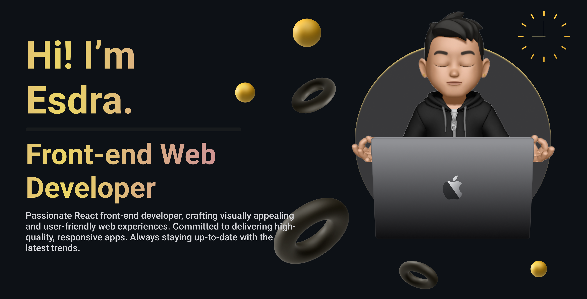

# Esdra Bergamasco - GitHub Profile

Hi there! 👋 Welcome to my GitHub profile! I'm Esdra, a passionate React front-end developer with a love for coding and creating innovative projects. Here, you'll find a mix of personal projects, open-source contributions, and other cool stuff I'm working on.

<!---
## 🚀 About Me

- 😄 Pronouns: [He/Him]
- 🌱 I'm currently learning [Next.js].
- 💬 Ask me about [Your expertise or interests].
- ⚡ Fun fact: [I am 100% self taught].
--->

## 🔧 Technologies & Tools

[Add a list of the programming languages, frameworks, tools, and technologies you are familiar with.]

## 📈 GitHub Stats

## 📫 Get in Touch

- GitHub: [esdra00](https://github.com/esdra00)
- LinkedIn: [Esdra Bergamasco](https://www.linkedin.com/in/esdra-bergamasco/)
- Website: [esdrabergamasco.com](https://esdrabergamasco.com/)

Feel free to reach out if you have any questions, collaboration ideas, or just want to say hi! I'm always open to meeting fellow developers and exploring exciting opportunities.
